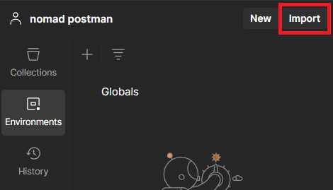
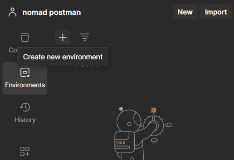
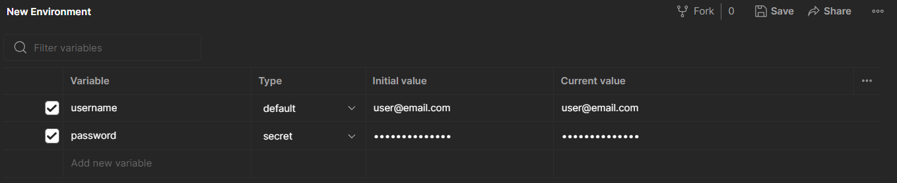

# postman
Postman JSON
## Import Postman Collection

To import the postman collection from github to postman, click the import button bellow the top bar on the left.

## Environment Variables

To use the Postman collection, you first need to set up an environment and import your Nomad Media credentials into environmental variables needed to access Nomad Media.

To create a new environment, do the following:

- Select Environments in the sidebar and select +.  
  Create new environment

- Enter a name for your new environment.
- Add any variables you want to the environment. You can also add variables later. Learn more about adding environment variables.
- Select Save icon to save any environment variables you added.
- To use the new environment, select it from the environment selector at the top right of the workbench. This makes it the active environment and sets all variables to the values specified in the environment.

  

Create two new environmental variables, named username and password. Set the password type to secret.

